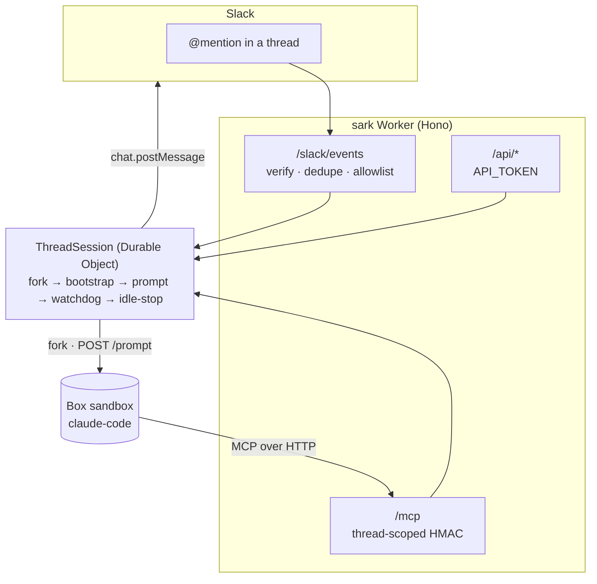

<h1 align="center">sark</h1>

<p align="center">
  
</p>

<p align="center">
  <em>🤖 Mention a bot in Slack; it forks a cloud sandbox for that thread and runs a coding agent inside it.</em><br>
  <em>Named after Tron's <strong>S</strong>lack <strong>A</strong>gent <strong>R</strong>untime <strong>K</strong>ernel —<br>the Master Control Program's lieutenant, who commands Programs on the Grid.</em>
</p>

<p align="center">
  <a href="../../actions"></a>
  
  
  
  
  
  
</p>

<p align="center">
  <a href="https://arjia-labs.github.io/sark/"></a>
</p>

<p align="center">
  <a href="https://arjia-labs.github.io/sark/"><strong>Docs</strong></a> ·
  <a href="#-quickstart"><strong>Quickstart</strong></a> ·
  <a href="#-testing-without-slack"><strong>No-Slack testing</strong></a> ·
  <a href="#-api"><strong>API</strong></a> ·
  <a href="#️-emoji-controls"><strong>Emoji controls</strong></a> ·
  <a href="#-setup"><strong>Setup</strong></a> ·
  <a href="AGENTS.md"><strong>Deploy runbook</strong></a> ·
  <a href="#-how-it-holds-together"><strong>Design</strong></a> ·
  <a href="#-not-in-scope"><strong>Not in scope</strong></a>
</p>

---

## 🤔 Why?

Running a coding agent from chat is easy to demo and hard to make safe. The moment more than
one person can mention the bot, you need answers to:

- 🧨 where does the agent's code actually *run*, and what else can it touch?
- 🧵 how do two threads avoid trampling each other's files?
- 🔓 what stops a public channel from spinning up unbounded sandboxes?
- 🤐 what happens when the agent finishes but never says anything?
- 🎭 when five people talk at once, who does the agent think it's answering?

`sark` is one answer. Every Slack thread gets **its own forked sandbox** on
[ascii.dev Box](https://docs.ascii.dev/box/api/v1). The agent inside talks back through an
MCP server hosted by this Worker, using a token that can only ever address the one thread it
was minted for. The allowlist fails closed, nothing holds ambient authority, and no two
threads share a filesystem.

## ✨ Highlights

| | |
|---|---|
| 🧵 **One sandbox per thread** | Each Slack thread forks its own Box. Conversation and filesystem stay in sync; threads never contend. |
| 🔐 **Thread-scoped MCP tokens** | Stateless HMAC naming one thread *and* one box generation, with an enforced issue time. A leaked token addresses nothing else. |
| 🚦 **Fail-closed allowlist** | Empty `ALLOWED_CHANNELS`/`ALLOWED_USERS` refuses *every* mention. You opt channels in, never out. |
| 🐕 **Watchdog** | A DO alarm polls the run; if the agent finishes silently, the reply is recovered from the box event log and posted anyway. The thread never goes quiet. |
| 📬 **Batched turns** | Messages arriving mid-run queue and drain into **one** turn, each as its own `<message>` block with its own sender, so the agent attributes requests correctly. |
| 🛡️ **Prompt-injection hardening** | Message bodies, display names, and metadata are untrusted: block delimiters are neutralized so nobody can speak under another user's name. |
| 💤 **Idle lifecycle** | Boxes archive (snapshot) after `IDLE_STOP_SECONDS` and resume onto the same filesystem on the next message. |
| 🎛️ **Contextual controls** | Buttons on the status message change with state: Stop/Watch while running; Re-run, Effort, Fork, Archive when done. The same six work as emoji reactions on any message. |
| 🍴 **Fork a conversation** | 🍴 branches the thread: a new thread with a fork of this box, starting from the same filesystem. |
| 🧪 **Slack-free testing** | `MemoryTransport` records everything the agent "says", so the whole pipeline is scriptable with no Slack app at all. |
| 🔁 **Token rotation** | `ensureMcp` re-mints and re-registers at half-life, so long threads rotate instead of expiring mid-run. |
| 🧯 **Amplifier limits** | `/mcp` caps a request at 32 batched calls and 1MB; the message queue holds at most 20. |
| ☁️ **One Worker, no infra** | Hono on Cloudflare Workers + a Durable Object per thread. No database, no queue, no server. |

## 📦 Requirements

- An **[ascii.dev Box](https://docs.ascii.dev/box/api/v1) account** — this Worker is a control
  plane for Box sandboxes and does nothing without one. You need a `box_...` API key.
- **Cloudflare Workers with Durable Objects.** The per-thread state machine is a DO with a
  SQLite backend, which is not available on the free plan.
- Node 22+ and the `box` CLI (for `npm run dev-vars`).
- A Slack app is **optional** — the `/api` surface exercises the whole pipeline without it.

Throughout the docs, `https://<your-worker>.workers.dev` stands in for your own deployed
origin. Replace it, and set the same value as `PUBLIC_URL` in `wrangler.jsonc`.

## 🚀 Quickstart

```bash
npm install
npm run dev-vars          # 🔑 writes .dev.vars (BOX_API_KEY comes from your `box` CLI login)
npm run dev               # ⚡ local worker on :8787

# one command: trigger, follow, print the agent's replies
npm run drive -- --thread demo "create hello.txt with the word banana and tell me what you did"
npm run drive -- --thread demo "what was in that file?"   # 🧵 same thread => same sandbox
npm run drive -- --thread demo --stop                     # 💤 archive the sandbox
```

That's the whole core loop, with no Slack app involved.

## 🧪 Testing without Slack

The `/api` surface drives the exact same Durable Object path — only the trigger and the
output sink differ. With `MemoryTransport`, everything the agent "says" is recorded and
readable back.

For the agent to actually reach `/mcp`, `PUBLIC_URL` must be publicly reachable, so full
end-to-end runs go against the deployed Worker:

```bash
npm run drive -- --url https://<your-worker>.workers.dev --thread demo "hello"
```

Against a local worker the box cannot call back, so the run exercises the watchdog fallback
path instead (the reply is recovered from the box event log).

## 🔌 API

All routes require `Authorization: Bearer $API_TOKEN`, and fail closed (503) if `API_TOKEN`
is unset.

> [!WARNING]
> **`API_TOKEN` is full bot authority.** `/api` deliberately bypasses the Slack allowlist: a
> caller can address any thread id, and by passing `slack` coordinates on a prompt, make the
> bot post into any conversation the bot token can reach. That is what makes the surface
> useful for scripting, but it means `API_TOKEN` should be guarded exactly like
> `SLACK_BOT_TOKEN` — the allowlist constrains Slack mentions, not this.

| Route | Purpose |
|---|---|
| `POST /api/threads/{id}/prompt` | `{text, user?, userName?, metadata?, transport?, slack?}` — same thing a mention does |
| `GET /api/threads/{id}` | box id, box state, phase, prompt status, `mcpRegistered`, `lastError` |
| `GET /api/threads/{id}/messages?after=n` | everything the agent posted through MCP; `n` is a message `seq` (monotonic per thread), not an array index |
| `GET /api/threads/{id}/events?cursor=` | raw Box event feed, for debugging |
| `POST /api/threads/{id}/interrupt` | stop the running agent |
| `DELETE /api/threads/{id}` | archive the sandbox and clear session state |

`{id}` is any opaque string. Slack threads use `{team}:{channel}:{thread_ts}`, so a live
Slack conversation can be inspected through the same API.

```bash
curl -sX POST localhost:8787/api/threads/t1/prompt \
  -H "Authorization: Bearer $API_TOKEN" -H 'content-type: application/json' \
  -d '{"text":"run the tests","metadata":{"ticket":"ENG-42"}}'
```

Anything in `metadata` is passed through into the prompt's context block. Prompt text is
capped at 16k characters: `/api` rejects anything longer with a 413, while Slack input is
truncated rather than refused.

### 🧰 MCP tools

The agent inside the box gets exactly five tools, none of which take a `channel` or `thread`
parameter — the destination is fixed by the token:

`slack_post_message` · `slack_update_message` · `slack_add_reaction` · `slack_upload_file` · `slack_get_thread`

## 🛠️ Setup

> [!TIP]
> Deploying with a coding agent? Point it at [`AGENTS.md`](AGENTS.md) — a phased runbook with
> checks between steps, and explicit stop-and-ask points for the decisions it shouldn't make
> on your behalf (billing plan, allowlist, workers.dev subdomain).

### 1. Template box (optional but recommended)

Without `TEMPLATE_BOX_ID` each thread gets a fresh box. With one, threads fork a snapshot
that already has your stack, repos, and MCP settings.

```bash
box new                      # 📦 install your stack, clone repos
box stop <id>                # 📸 the snapshot IS the template
# set TEMPLATE_BOX_ID=<id> in wrangler.jsonc
```

Keep the template stopped; resume → update → stop to publish a new version.

### 2. Deploy

```bash
npx wrangler secret put BOX_API_KEY        # box_... from the Box dashboard
npx wrangler secret put MCP_TOKEN_SECRET   # any long random string
npx wrangler secret put API_TOKEN          # guards /api
npx wrangler deploy
```

Set `PUBLIC_URL` in `wrangler.jsonc` to the deployed origin — the box reads it to find `/mcp`.

### 3. Slack (optional)

Create the app from `slack-manifest.json`, install it, then:

```bash
npx wrangler secret put SLACK_BOT_TOKEN      # xoxb-...
npx wrangler secret put SLACK_SIGNING_SECRET
```

Set `ALLOWED_CHANNELS` / `ALLOWED_USERS` in `wrangler.jsonc` (and optionally `ALLOWED_TEAMS`
to pin the workspace). **The allowlist fails closed** — with both empty, every mention is
refused. This is what stops a public channel from spinning up unbounded sandboxes. It gates
`/slack/events` only; `/api` is behind `API_TOKEN` and bypasses it by design.

The manifest enables interactivity and points it at `/slack/interactive`, which handles only
the 🧠 effort dropdown. That handler verifies the signature and runs the **same `isAllowed`
gate** as a mention before acting. Without the gate, anyone who could see the message could
drive the sandbox.

Say `stop` in a thread to interrupt the running agent.

## 🎛️ Emoji controls

The status message carries buttons for whatever makes sense right now. While a run is going
that is **Stop** and **Watch**; once it is over, stopping means nothing and the buttons become
**Re-run**, **Effort**, **Fork**, and **Archive**. Fork and Archive open a native confirm
dialog first, because one spends money and the other kills a live sandbox.

The same six actions also work as **emoji reactions on any message in the thread**, which
buttons cannot do since they only live on the status message:

| | Button | Action | What happens |
|---|---|---|---|
| 🛑 | Stop | **Interrupt** | Stops the running agent and clears the queue |
| ♻️ | Re-run | **Re-run** | Re-issues the last prompt verbatim, at the same effort |
| 🧠 | Effort | **Change effort** | Posts a dropdown; picking a level re-runs the last prompt at it |
| 🍴 | Fork | **Fork** | Branches the conversation (see below) |
| 🖥️ | Watch | **Watch** | Returns a desktop/VNC link for the sandbox |
| 💤 | Archive | **Archive** | Snapshots and stops the box now instead of waiting out the idle timer |

The reactions are not pre-seeded. Six emoji on every status message outlived their meaning,
and pre-seeding the costly ones is an invitation to click them.

Reactions are ordinary Events API events, so they arrive at `/slack/events` behind the same
signature check and the same fail-closed allowlist as a mention. A reaction from someone the
allowlist doesn't cover is dropped **silently**. Replying would turn any emoji in a public
channel into a way to make the bot talk.

A `reaction_added` payload carries `item.{channel,ts}` and **no `thread_ts`**, so the thread
is recovered with one `conversations.replies` call. That method accepts the ts of any message
in a thread and answers parent-first, so `messages[0].ts` is the thread. A reaction on a
thread with no session does nothing. Reacting can only act on a sandbox that already exists,
never create one.

### 🍴 Forking a conversation

🍴 opens a **new top-level thread** in the same channel and gives it a fork of this thread's
box, so it starts from the current filesystem without disturbing the original. Use it to try
two approaches from one setup, or to peel a tangent off a long thread. The new thread is
opened first because its `ts` is the thread id baked into the forked box's env, and box env
is fixed at fork time.

> [!IMPORTANT]
> A forked filesystem inherits the parent's MCP registration, so until it is re-registered
> the fork holds a credential naming the *parent* thread. Forked sessions therefore carry a
> `pendingBootstrap` flag and re-register as soon as the box is ready, rather than waiting
> for someone to speak. The window is the fork's provisioning time; it is not zero.

## 🧠 How it holds together



**🔐 Thread-scoped MCP tokens.** The box calls back with a stateless HMAC token that names one
thread *and* one box generation, and carries an issue time enforced on every use. So it only
ever addresses the thread it was minted for, only while that exact box is still the thread's
box, and only for 12 hours; `ensureMcp` re-mints and re-registers once a token is half-way to
expiry, so long threads rotate rather than expire mid-run. The token is **not** a box env var —
env is fixed at fork time, which would pin a box to one credential for life. It is written to
a file the bootstrap script reads and deletes as it registers the server. The box env carries
only `SLACK_MCP_URL`, `SLACK_THREAD_ID`, and (for Slack threads) `SLACK_CHANNEL`,
`SLACK_THREAD_TS`, `SLACK_TEAM`. The MCP tools have no `channel` or `thread` parameter at all,
and `/mcp` caps a request at 32 batched calls and 1MB, so a compromised box cannot post
anywhere else in the workspace or use the endpoint as an amplifier.

**🐕 The watchdog.** The agent is supposed to reply via MCP, but it can fail to. A Durable
Object alarm polls the prompt status; if the run finishes or fails with nothing said, the
reply is recovered from the box event log and posted anyway — the thread never goes silent.
Silence also clears the MCP registration flag, so the next turn re-registers and self-heals.

**💤 Lifecycle.** Idle threads archive their box after `IDLE_STOP_SECONDS` (snapshotting it).
A later message resumes it onto the same filesystem and re-registers MCP with a fresh token.

**🧵 One run per thread.** A thread runs a single agent prompt at a time. Messages that arrive
while a run is in flight are queued in the Durable Object; when the run finishes they are
drained into **one** batched turn (not replayed one by one). Each message is rendered as its
own `<message>` block carrying its own sender, message id, permalink, and `/api` metadata, so
the agent attributes every request to the person who actually made it — not to whoever spoke
first. Message bodies, display names, and metadata are untrusted text, so the delimiters the
prompt is built from are neutralized inside them: a user cannot close their own block and
open one under someone else's name. The queue holds at most 20 messages; past that, further
messages are refused with a notice rather than piling up work nobody is still waiting for.
Different threads never contend; each has its own box.

## 📁 Layout

| Path | |
|---|---|
| `src/index.ts` | routes: `/slack/events`, `/mcp`, `/api/*` |
| `src/do/ThreadSession.ts` | the state machine: fork → bootstrap → prompt → watchdog → idle-stop |
| `src/box/client.ts` | Box API v1 client |
| `src/box/bootstrap.ts` | registers this Worker's MCP server inside a box |
| `src/mcp/` | stateless JSON-RPC MCP server + the five Slack tools |
| `src/transport.ts` | `Transport` interface; `MemoryTransport` (the testing sink) |
| `src/slack/` | signature verification, event interpretation, `SlackTransport` |
| `scripts/drive.ts` | CLI that drives a thread end to end |
| `scripts/box-smoke.ts` | Box credentials/template check, independent of the Worker |

## 🙅 Not in scope

`sark` is deliberately small. It does **not** try to be:

- 🏢 a multi-tenant SaaS — one Worker, one Box account, one workspace's allowlist
- 💬 a general Slack framework — five tools, two event types, one dropdown, no slash commands
- 🧮 a job queue — one run per thread, a bounded backlog, and no cross-thread scheduling
- 🔗 a bridge to other chat platforms — though `Transport` is the seam where one would go

## 🤝 Contributing

PRs welcome. Before sending:

```bash
npm run typecheck
npm test           # 🧪 87 tests (node + a workerd project for the Durable Object)
npm run smoke      # 🔍 verify Box API access and template
```

## 📜 License

MIT — see [LICENSE](LICENSE).

<p align="center">
  <sub>End of line. ⚡</sub>
</p>
